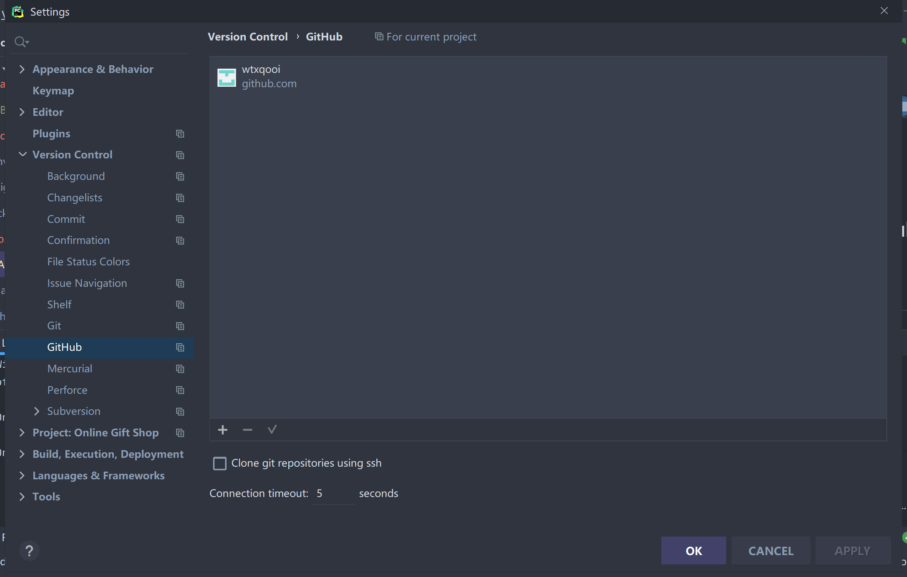
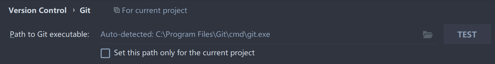
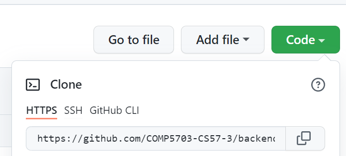
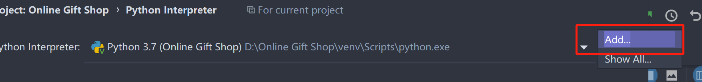
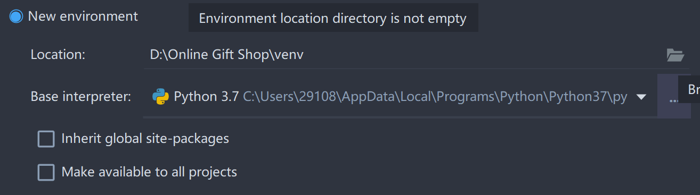
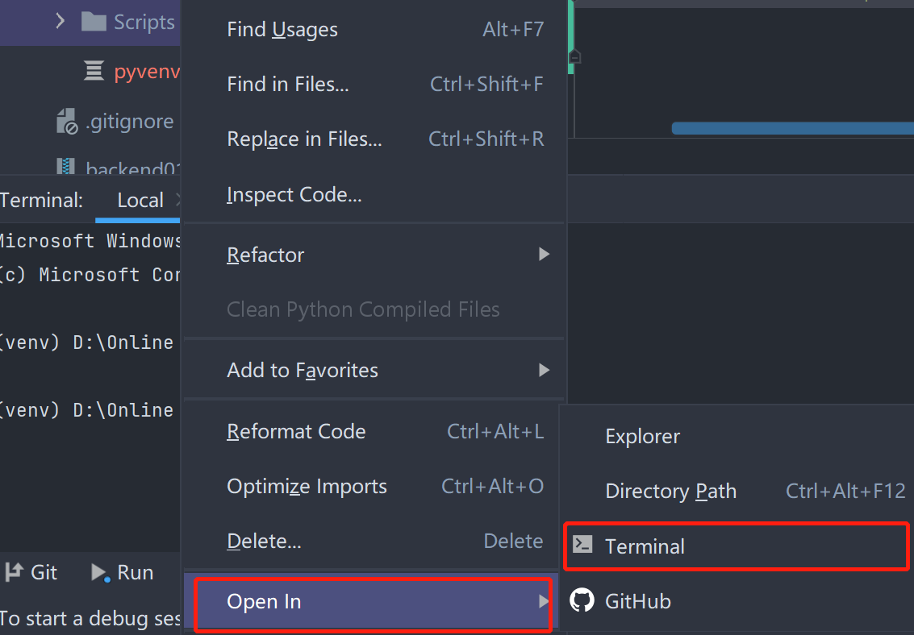
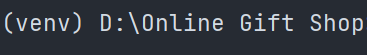

# 1. 安装pycharm
# 2. 安装git
    参考 https://www.cnblogs.com/xueweisuoyong/p/11914045.html
# 3. 在pycharm中配置git和github
点击file栏，找到settings，点击version control表单，点击github    

点击左下角加号，授权登录账户，不要勾选ssh选项  
点击git，检查系统的git有没有被检测到，点击test进行测试，如果没有检测到，需要手动添加  

# 4. 导入项目
在pycharm顶栏找到VCS，点击import from version control    
输入从网页复制的repository的url  

等待导入完成  
# 5. 配置项目使用的虚拟环境
打开settings，找到Project：Online Gift Shop   
点击project interpreter  
检查项目当前使用的虚拟环境路径是否为项目根目录下的venv文件夹  
如果不是，点击add  

选择从new environment中添加，找到右侧的文件夹图标，点击，找到项目根目录，添加venv文件夹，点击创建 

此时虚拟环境中还不包含项目所需要的python包  
在项目结构目录中找到venv->Scripts，在此处右键单击，选择open in->terminal   

执行以下命令激活虚拟环境

    activate.bat
然后前往requirements.txt所在目录安装python库  

    pip install -r requirements.txt
*注意，每次执行命令行python命令前都要注意是否在正确的虚拟环境中 （venv）*

# 6. git操作
连接上远程git库后软件右上角会显示三个命令  

    update 接收远程仓库的更新
    commit 提交本地更新
    push 更新远程仓库
commit会确认远程仓库和本地更新的不同，提交者需要确认每一个更改后才能push  
在push时需要选择想要更新的文件，选择想要更新的commit版本  
基本流程 打开软件先update->编写完成使用commit->确认无误后使用push，规律的使用update尽可能的避免版本冲突  

### pycharm 频繁出现需要git重新登陆的错误
选择通过token登录
在以下网址上生成个人token，推荐勾选所有权限
    https://github.com/settings/tokens
将生成的token复制到pycharm中

    
