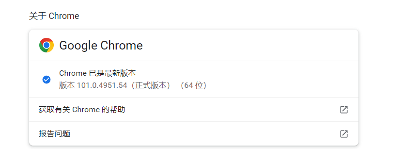
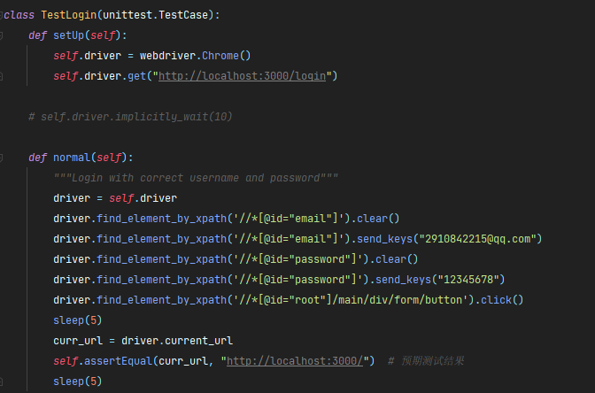
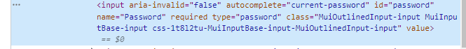
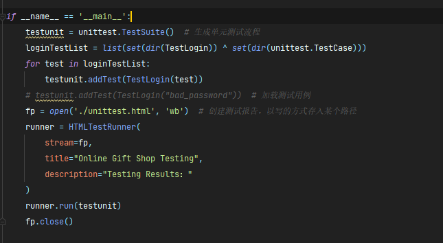

## 配环境

1. pip install selenium
2. 检查chrome版本
3. 访问网站，下载对应版本的webdriver  https://registry.npmmirror.com/binary.html?path=chromedriver/
4. 将webdriver放到venv/script文件夹下
5. 将Testing文件夹下的HTMLTestRunner.py文件复制到venv/lib/site-packages里面
6. 运行Testing/run_test.py 文件，查看运行是否正常

## 单元测试

1. 所有测试用例放置在测试类中，测试类的命名可以为Test单元名
2. setUP和Teardown函数不用动
3. normal为测试用例函数
4. 用浏览器打开前端页面，F12选中输入框找到元素位置
   
   右键复制，复制Xpath,将xpath复制到driver.find_element_by_xpath定位元素 clear是清除当前内容，sends_keys是填充数据 click是点击
   assertEqual是将预期测试结果与实际结果比对，如果不一样则测试用例失败

## 运行测试

1. 所有测试用例应该被放在同一个报告里呈现
2. loginTestList是TestLogin类中所有测试用例的函数名
3. 这些函数名需要被加入到到测试计划中
4. 运行
